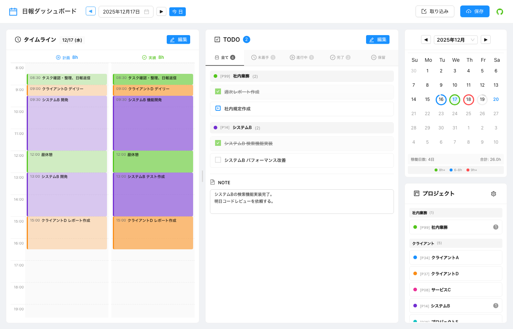

# mdJournal

**Markdown日報を視覚的に管理するダッシュボードアプリケーション**

[](https://www.npmjs.com/package/mdjournal)
[](https://opensource.org/licenses/MIT)

<p align="center">
  
</p>

## ✨ 特徴

- 📅 **カレンダービュー** - 月表示で稼働時間を可視化
- ⏱️ **タイムライン** - 計画と実績を並べて表示、ドラッグ&ドロップで編集
- ✅ **TODO管理** - プロジェクト別・ステータス別のタスク管理
- 📝 **Markdown編集** - 慣れ親しんだMarkdown形式でデータを管理
- 🔗 **外部連携** - Git、Slackとの連携

---

## 📋 機能一覧

### ダッシュボード

| 機能 | 状態 | 説明 |
|------|:----:|------|
| カレンダービュー（月表示） | ✅ | 稼働時間を円ゲージで可視化 |
| タイムライン | ✅ | 計画(PLAN)と実績(RESULT)の並列表示 |
| タイムスロットのドラッグ&ドロップ | ✅ | 時間調整（スナップ単位で） |
| TODO一覧 | ✅ | プロジェクト別・ステータス別表示 |
| TODOステータス変更 | ✅ | 未着手→進行中→完了→保留 |
| プロジェクト一覧 | ✅ | 残TODO件数表示 |
| プロジェクトフィルタ | ✅ | 選択したプロジェクトでフィルタリング |
| Markdownエディタ | ✅ | 日報のMarkdown直接編集 |
| ルーチン取り込み | ✅ | 曜日別・月次・四半期・年次ルーチン |
| レイアウトカスタマイズ | 🚧 | パネル配置の変更（部分実装） |
| ダークモード | ❌ | 未実装 |

### 外部連携

| 機能 | 状態 | 説明 |
|------|:----:|------|
| Git連携（Commit/Push） | ✅ | ローカルリポジトリと自動連携 |
| Slack投稿（Webhook） | ✅ | 日報をSlackチャンネルに投稿 |
| Googleカレンダー連携 | ❌ | 未実装（APIはモックのみ） |
| 拡張機能システム | ❌ | 未実装 |

### CLIツール

| 機能 | 状態 | 説明 |
|------|:----:|------|
| サーバー起動 | ✅ | `npx mdjournal [config.yaml]` |
| バリデーション | ✅ | `npx mdjournal validate <path>` |
| 統計情報再集計 | ✅ | `npx mdjournal stats <path>` |
| 設定ファイルチェック | ✅ | `npx mdjournal config <config.yaml>` |

**凡例**: ✅ 実装済み / 🚧 部分実装 / ❌ 未実装

---

## 🚀 クイックスタート

```bash
# サンプルデータで起動
npx mdjournal

# ブラウザでアクセス
open http://localhost:3001
```

## 📦 インストール

```bash
npm install -g mdjournal
```

## 📖 使い方

### 設定ファイルを指定して起動

```bash
npx mdjournal ./mdjournal.config.yaml
```

### 設定ファイルの作成

```yaml
# mdjournal.config.yaml
projects: ./config/projects.yaml
routines: ./config/routines.yaml
reports: ./data

timeline:
  hourHeight: 60
  maxHours: 36
  defaultStartHour: 8
  defaultEndHour: 20
  snapMinutes: 15

server:
  port: 3001

# Slack連携（オプション）
slack:
  enabled: false
  webhookUrl: ${SLACK_WEBHOOK_URL}
  channel: "#daily_report"
```

### 日報ファイルのバリデーション

```bash
# ディレクトリ内の全.mdファイルを検証
npx mdjournal validate ./data

# 詳細出力
npx mdjournal validate ./data --verbose

# 厳格モード
npx mdjournal validate ./data --strict
```

### 統計情報の再集計

```bash
# frontmatterを付与・更新
npx mdjournal stats ./data

# プレビューのみ
npx mdjournal stats ./data --dry-run
```

## 📋 日報フォーマット

```markdown
---
planHours: 8.0
resultHours: 7.5
todoCount: 5
todoCompleted: 2
todoInProgress: 1
updatedAt: 2025-12-18T17:30:00+09:00
---
# [日報] サンプル太郎 2025-12-18

## [PLAN]
* 08:30 [P99] タスク確認・整理
* 09:00 [P34] クライアントA MTG
* 12:00
* 13:00 [P14] 開発作業
* 18:00

## [RESULT]
* 08:30 [P99] タスク確認・整理
* 09:00 [P34] クライアントA MTG
* 12:00
* 13:00 [P14] 開発作業
* 19:00

## [TODO]

### P99
- [ ] @2025-12-20 !!! 重要タスク
- [*] !! 進行中タスク
- [x] 完了タスク

### P34
- [ ] レビュー対応

## [NOTE]
本日のメモ
```

### TODOステータス

| 記号 | 状態 | 説明 |
|------|------|------|
| `[ ]` | 未着手 | タスク未開始 |
| `[*]` | 進行中 | 作業中 |
| `[x]` | 完了 | タスク完了 |
| `[-]` | 保留 | 一時停止中 |

### 優先度

| 記号 | 優先度 |
|------|--------|
| `!!!` | 高 |
| `!!` | 中 |
| `!` | 低 |

## 🗂️ プロジェクト構成

```
my-journals/
├── data/                    # 日報ファイル
│   └── YYYY/MM/
│       └── YYYY-MM-DD.md
├── config/
│   ├── projects.yaml        # プロジェクト定義
│   └── routines.yaml        # ルーチン定義
├── mdjournal.config.yaml    # ルート設定
└── .env                     # 環境変数（APIキー等）
```

## 🔗 外部連携

### Git連携

日報ディレクトリがGitリポジトリ内にある場合、「保存」ボタンから開くダイアログでcommit/pushを実行できます。
保存ダイアログでは「保存のみ」「Commitまで」「Pushまで」の3段階から選択できます。

### Slack連携

Webhook URLを設定することで、日報をSlackチャンネルに投稿できます。

```yaml
# mdjournal.config.yaml
slack:
  enabled: true
  webhookUrl: ${SLACK_WEBHOOK_URL}  # 環境変数から取得
  channel: "#daily_report"
  username: "日報"
  iconEmoji: ":memo:"
```

## 📚 ドキュメント

- [要求仕様書](./docs/requirements.md)
- [Markdownフォーマット仕様](./docs/markdown-format-spec.md)
- [設定ファイル仕様](./docs/config-spec.md)
- [API仕様 (OpenAPI)](./docs/openapi.yaml)

## 🛠️ 開発

```bash
# リポジトリをクローン
git clone https://github.com/your-username/mdjournal.git
cd mdjournal

# サーバー側の依存関係インストール
cd server
npm install

# クライアント側の依存関係インストール
cd ../client
npm install

# サーバー起動（開発モード）
cd ../server
npm run dev

# 別のターミナルでクライアント起動
cd ../client
npm run dev
```

## 📄 ライセンス

MIT License

## 🤝 コントリビューション

1. Issueで機能要望やバグ報告
2. Pull Requestでコード貢献
3. ドキュメントの改善

---

**mdJournal** - Markdown日報をもっと便利に
